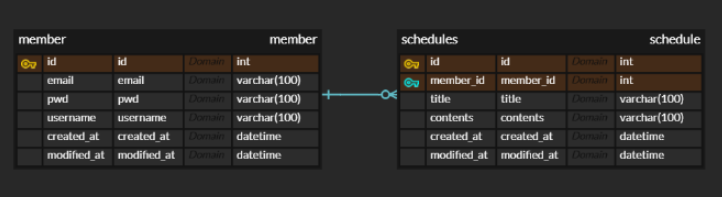

# sparta-scheduleapp

---
1. [일정관리 앱 API 명세서](#일정관리-앱-API-명세서)
2. [ERD](#ERD)
---

## 일정관리 앱 API 명세서

|    기능    | Method |           URL           | request  |  response  |    상태코드     |
|:--------:|:------:|:-----------------------:|:--------:|:----------:|:-----------:|
|   일정생성   |  POST  |       /schedules        | 요청 body  |   일정 정보    | 201 : 정상 등록 |
| 전체 일정 조회 |  GET   |       /schedules        | 요청 param |  다건 응답 정보  | 200: 정상 조회  |
| 선택 일정 조회 |  GET   | /schedules/{scheduleId} | 요청 param |  단건 응답 정보  |  200: 정상조회  |
| 선택 일정 수정 | PATCH  | /schedules/{scheduleId} | 요청 body  |   수정 정보    | 200: 정상 수정  |
| 선택 일정 삭제 | DELETE | /schedules/{scheduleId} | 요청 param |     -      | 200: 정상 삭제  |
|  유저 생성   |  POST  |     /members/signup     | 요청 body  |     -      | 201: 정상 생성  |
| 특정 유저 조회 |  GET   |      /members/{id}      | 요청 param  |     -      | 201: 정상 생성  |
| 특정 유저 수정 | PATCH  |      /members/{id}      | 요청 param  |     -      | 201: 정상 생성  |
| 특정 유저 삭제 | DELETE |      /members/{id}      | 요청 param  |     -      | 201: 정상 생성  |
|   로그인    |  POST  |     /members/login      | 요청 body  |     -      | 201: 정상 생성  |

 

## ERD

